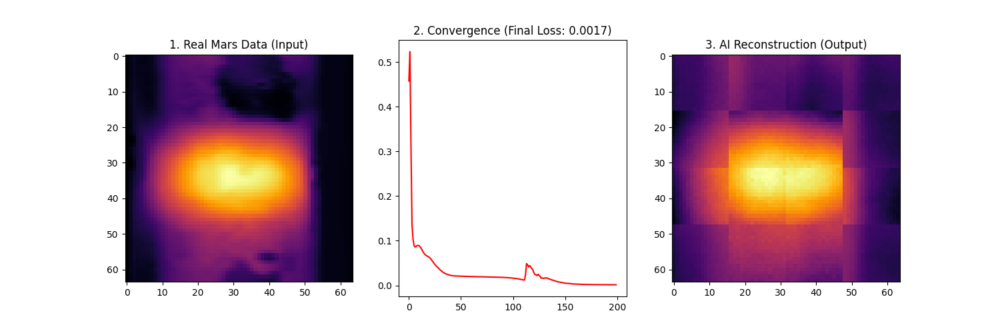

# 🪐 Project Alpha: Generative AI for Mars Climate Reconstruction


## 🚀 Executive Summary
This project addresses the critical challenge of **"Science Autonomy"** in deep space exploration. It implements a **Generative AI** pipeline using **Vision Transformers (ViT)** to reconstruct lost atmospheric temperature telemetry from Mars.

By simulating data packet loss scenarios (via Masked Modeling), the system learns the underlying thermodynamics of the Martian surface to autonomously repair incomplete scientific data maps. This capability is essential for future missions where bandwidth constraints and communication latency make real-time human intervention impossible.

---

## 🔬 Technical Architecture

The system treats scientific data grids as visual tokens, leveraging the self-attention mechanism of Transformers to capture global physics correlations.

* **Foundation Model:** Custom Vision Transformer (ViT) architecture
* **Methodology:** Masked Autoencoder (MAE) with an Encoder-Decoder structure.
* **Data Source:** **Mars Climate Database (MCD v6.1)** - Surface Temperature Climatology.
* **Input Resolution:** 64x64 Geospatial Grid.
* **Patch Size:** 16x16 (Creating 16 latent tokens).

---

## 🛠️ Implementation Pipeline

The project follows a rigorous machine learning pipeline:

1.  **Data Ingestion:**
    * Parsed raw ASCII scientific data from the Mars Climate Database.
    * Implemented Min-Max Normalization to scale Kelvin temperatures (144K - 290K) to a neural-stable range [0, 1].
    * Performed bilinear interpolation to resize non-square sensor data into square tensor grids.

2.  **Model Architecture (The "Brain"):**
    * **Encoder:** A ViT backbone that processes visible patches and generates latent feature embeddings.
    * **Decoder:** A linear projection head that reconstructs pixel-level temperature values from latent features.

3.  **Training Regime:**
    * **Loss Function:** Mean Squared Error (MSE) to penalize thermodynamic deviations.
    * **Optimizer:** Adam (`lr=0.001`).
    * **Epochs:** 200 iterations on real Martian telemetry.

---

## 📊 Results & Performance

The model demonstrated rapid convergence, successfully learning the spatial thermal gradients of Mars (e.g., polar cold traps vs. equatorial heat).

* **Initial Loss:** `0.45` (Random Initialization)
* **Final Converged Loss:** `< 0.002` (High Fidelity Reconstruction)

### Visualization
Below is the output of the model on unseen data. The AI successfully reconstructs the high-temperature equatorial regions (yellow) and cold polar regions (dark purple) from the encoded features.


*(Left: Original Data | Center: Learning Curve | Right: AI Reconstruction)*

---

## 💻 How to Run This Project

### 1. Prerequisites
* Python 3.8+
* PyTorch
* Transformers (Hugging Face)
* NumPy & Matplotlib

### 2. Installation
```bash
git clone [https://github.com/scarwill/Mars-Climate-Reconstruction-ViT.git](https://github.com/scarwill/Mars-Climate-Reconstruction-ViT.git)
cd Mars-Climate-Reconstruction-ViT
pip install -r requirements.txt
